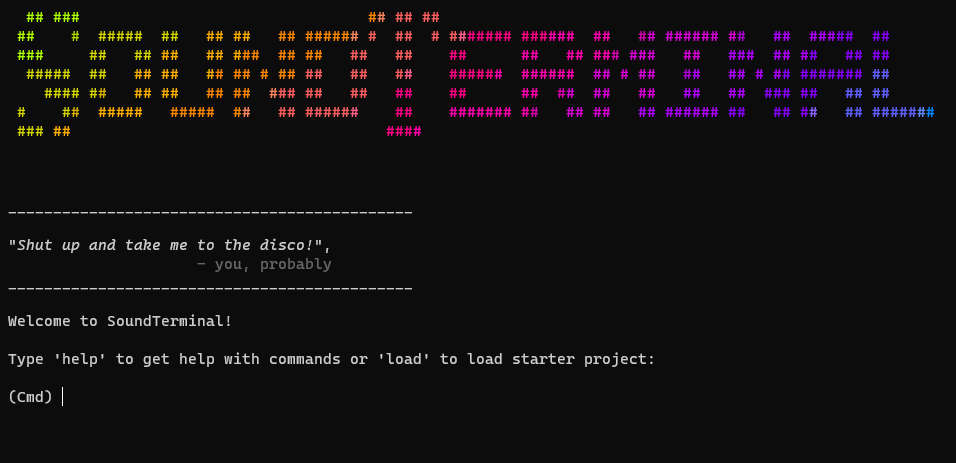

# SoundTerminal

SoundTerminal is a Python application that allows you to create some beats in terminal using ASCII characters and some samples.




## Why

Making music in a terminal can be a fun and unique experience for a few reasons. First, it combines love for music with interest in technology and coding. Second, it gives users the ability to create music using ASCII characters and the console as your instrument. This can be a fun and challenging creative exercise that pushes you to explore new ideas and techniques. Additionally, making music in terminal is a more stripped-down experience than using traditional music-making software, which can be refreshing and inspiring in its simplicity.

# Getting Started

Audio API support:

- miniaudio - https://github.com/irmen/pyminiaudio/
- soundcard - https://soundcard.readthedocs.io/
- sounddevice - http://python-sounddevice.readthedocs.io/

You will need to install one of these packages. 
In requirements.txt there is miniaudio lib reference, but you can just do:

 ``` pip install miniaudio``` 


To get started with SoundTerminal, follow these simple steps:

    - Install Python (>=3.9) on your machine (if it's not already installed).
    - Clone this repository to your local machine.
    - Navigate to the directory where you cloned the repository.

    - Run: 
        python soundterminal.py - to launch the application.
      or
         python soundterminal.py empty - to launch starter project

    - Follow the instructions to create your own beats and melodies.

# Features

SoundTerminal offers a range of features that make it fun tool for making beats, backing tracks, write quick ideas, including:

    - Simple, intuitive CLI interface
    - Customizable BPM (beats per minute) settings
    - Customizible patterns Ticks per beat
    - Pattern chain sequencing (like PO)
    - Add more samples to samples/ folder
    - Sharable project tracks in .st format
    - Easy-to-use - gen command to quickly create some ascii bars
    - Quickly add/remove samples, bars, patterns
    - Ability to save and export your creations as wav file

# How-to

Use ``` help <command> ``` to see how to use all other available commands.

Add samples to project: 
``` add shortname samplename.wav ```

Add empty pattern:
``` new patternname ```

Copy pattern: ``` copy pat1 pat2 ```

Play sequence:
``` play ```

Play pattern:
``` playp pat2 pat4 ```

Play sample: ``` plays bass ```

Play sample in a bar:
``` plays bass x... x... x... xx.. ```

Show sequence:
``` seq ```

Arrange sequence:
``` seq pat1 pat1 pat2 pat2 pat3 pat5 ```

Generate a random bar in pattern:
``` edit pat1 clap gen ```

Remove sample from pattern:
``` edit pat1 clap ```

Add sample bar in pat1:
``` edit pat1 clap x... xx.. xx.. x... ```

Export to file:
``` export trackname ```

# Contributing

Contributions to SoundTerminal are always welcome! If you have an idea for a new feature or improvement, please feel free to submit a pull request. For major changes, please open an issue first to discuss what you would like to change.


This app is based on this [archived project](https://github.com/irmen/synthesizer) by [@irmen](https://github.com/irmen)